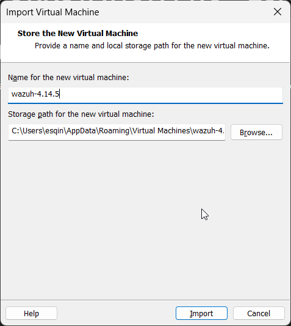

# 🛡️ SOC Automation & Threat Detection Lab

## 📌 Project Overview
This project demonstrates the design and implementation of a home-based Security Operations Center (SOC) lab. The environment simulates real-world cyber attack scenarios and enables threat detection, log analysis, and incident response using **Wazuh SIEM/XDR**, **pfSense Firewall**, and endpoint telemetry.

---

## 🏗️ Lab Architecture
- **SIEM/XDR:** Wazuh Manager (Ubuntu-based OVA)
- **Firewall/Gateway:** pfSense
- **Victim Machine:** Windows 11 Enterprise
- **Attacker Machine:** Kali Linux
- **Network:** Isolated Virtual LAN (VMnet2)

## ⚙️ Resource Allocation:

| Virtual Machine | OS | RAM | Storage |
| :--- | :--- | :--- | :--- |
| **Wazuh Server** | Ubuntu | 3 GB | 50 GB |
| **pfSense** | FreeBSD | 512 MB | 20 GB |
| **Windows Victim**| Windows 11 | 2 GB | 60 GB |

---

## 🛠️ Step 1: Virtual Infrastructure & Resource Optimization

  
*Wazuh VM resource allocation.*

  
*Kali Linux VM configuration.*

  
*pfSense VM configuration.*

---

## 🛡️ Step 2: pfSense Installation & Network Configuration

I configured **pfSense** as the gateway for the lab. It manages two network interfaces:
1. **WAN (NAT):** Provides internet access for updates.
2. **LAN (VMnet2):** An isolated network where the Victim and SIEM reside.

  
*Initial pfSense installation.*

  
  
  
  
*Disk partitioning process.*

  
*WAN/LAN interface configuration.*

  
*pfSense web dashboard.*

---

## 💻 Step 3: Windows 11 Victim Deployment

To deploy Windows 11 in a resource-constrained environment, I bypassed the RAM and TPM requirements using Registry Editor during the installation phase.

  
*Windows installation process.*

  
*Bypassing system requirements.*

  
*Network verification.*

  
*System setup completion.*

  
*Windows configuration.*

---

## 🔍 Step 4: Endpoint Telemetry (Sysmon + Wazuh Agent)

  
*Sysmon installation.*

  
*Sysmon configuration completed.*

  
*Wazuh agent started.*

  
*Agent registration/import.*

---

## 🌐 Step 5: Network Connectivity Verification

  
*Connectivity between Windows and pfSense.*

---

## ⚔️ Step 6: Attack Simulation (Kali Linux)

  
*Initial reconnaissance scan.*

  
*Full port scan.*

---

## 🚨 Step 7: Detection & Alerting (Wazuh)

  
*Wazuh system health.*

  
*Connected agents.*

  
*Generated security alerts.*

---

## 📊 Step 8: Log Analysis & Threat Hunting

  
*Detailed log analysis.*

  
*Threat hunting activity.*

---

## 🔐 Additional Configurations

  
*Firewall rule testing.*

  
*Windows firewall adjustments.*

---

## 🧠 Key Skills Demonstrated
- SIEM deployment & configuration (Wazuh)
- Firewall & network segmentation (pfSense)
- Endpoint telemetry (Sysmon, Wazuh Agent)
- Network reconnaissance detection (Nmap)
- Log analysis & alert triage
- Threat hunting

---

## 🚀 Conclusion
This lab demonstrates a complete SOC workflow: from infrastructure setup to attack simulation, detection, and investigation. It reflects real-world blue team operations in a controlled environment.
