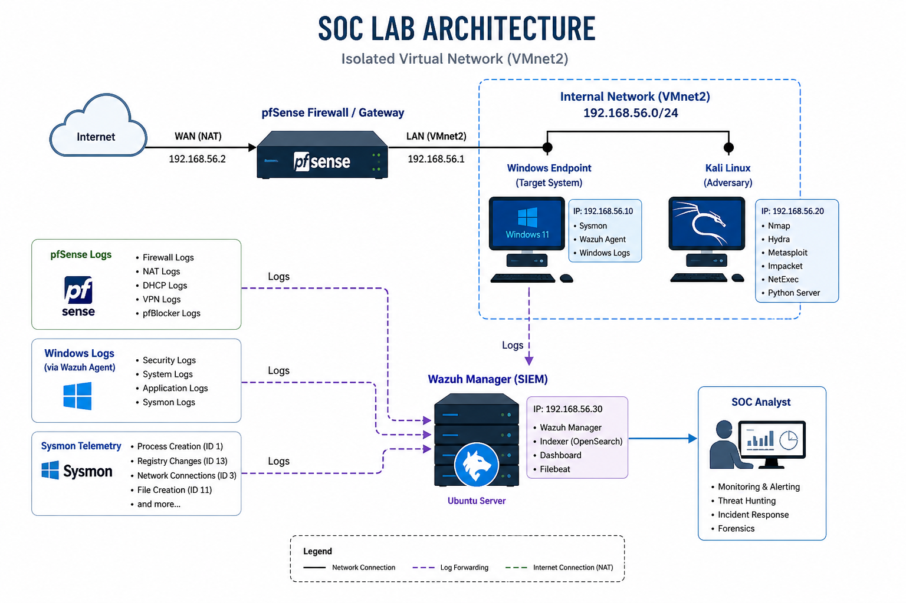
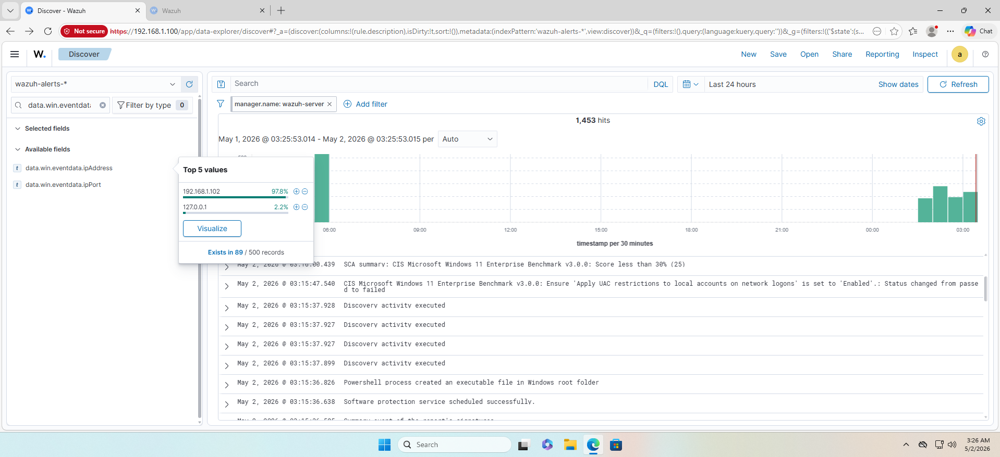
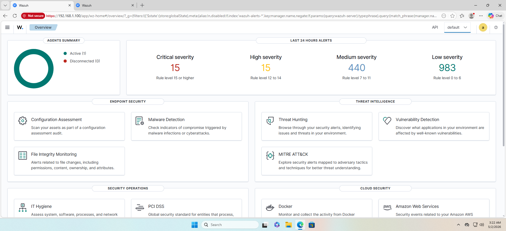

# 🛡️ End-to-End SOC Automation & Threat Detection Lab

## 📌 Project Overview
This comprehensive project demonstrates the architecture, deployment, and operation of a modern Security Operations Center (SOC). It covers the full lifecycle: **Infrastructure Setup**, **Attack Simulation (Red Teaming)**, and **Detection & Analysis (Blue Teaming)** using Wazuh SIEM, pfSense, and Sysmon.

## 📊 Lab Architecture



---

## 🏗️ Phase 1: Virtual Infrastructure & Networking
The lab is hosted on an isolated Virtual LAN (VMnet2) to simulate an enterprise environment while ensuring safety.

### ⚙️ Resource Allocation & VM Settings

| Component | OS | Role | RAM | Disk |
| :--- | :--- | :--- | :--- | :--- |
| **Wazuh Manager** | Ubuntu | SIEM/XDR | 3 GB | 50 GB |
| **pfSense** | FreeBSD | Firewall/GW | 512 MB | 20 GB |
| **Windows Target Endpoint**| Windows 11 | Target | 2 GB | 60 GB |
| **Kali Linux** | Debian | Adversary | 2 GB | 40 GB |

**Infrastructure Screenshots:**
  

---

## 🌐 Phase 2: Gateway & Endpoint Deployment

### 1. pfSense Firewall Configuration
Configured as the core router with WAN (NAT) and LAN (VMnet2) interfaces.
- **Partitioning & Setup:**  
- **Dashboard & Interfaces:**  

### 2. Windows 11 Target Endpoint Hardening & Telemetry
Deployed Windows 11 by bypassing TPM/RAM requirements and installing monitoring agents.
- **Bypass Requirements:** 
- **Connectivity:** 
- **Telemetry Setup:**
    - **Sysmon:** Installed for granular logging. 
    - **Wazuh Agent:** Forwarding logs to SIEM. 

---

## ⚔️ Phase 3: Attack Simulation (The Red Team)

The attack follows the Cyber Kill Chain: Recon -> Access -> Privilege Escalation -> Persistence -> Credential Harvesting.

### 1. Reconnaissance & Discovery
- **Nmap Attack:** Initial service discovery. 
- **Full Port Scan:** Identifying open RDP (3389) and SMB (445). 

### 2. Initial Access & Weaponization
- **Brute-Force:** Using **Hydra** to crack RDP credentials. 
- **Payload Generation:** Creating a reverse shell with **msfvenom**. 
- **Delivery:** Hosting the payload via Python web server. 

### 3. Exploitation & Post-Exploitation
- **Meterpreter Session:** Gaining initial access. 
- **Privilege Escalation:** Bypassing UAC to reach **SYSTEM** level.  
- **Remote Execution:** Using **Impacket-WMIExec** and **NetExec (NXC)** for command execution.  

### 4. Persistence & Lateral Movement
- **Process Migration:** Moving to `explorer.exe` and setting registry run keys. 
- **Backdoor Account:** Creating a hidden admin user. 
- **RDP Access:** Logging in as the backdoor user. 

---
## 🎯 Attack vs Detection Mapping

| Attack Step | Tool | Detection Source | Alert | MITRE ID |
|------------|------|-----------------|-------|----------|
| Recon | Nmap | pfSense logs | Port scan | T1046 |
| Brute Force | Hydra | Event ID 4625 | Multiple failures | T1110 |
| Initial Access | RDP | Event ID 4624 | Suspicious login | T1078 |
| Privilege Escalation | Meterpreter | Sysmon Event ID 1 | New process | T1548 |
| Persistence | Registry | Sysmon Event ID 13 | Registry change | T1547 |
| Lateral Movement | WMIExec | Event ID 4688 | Remote execution | T1047 |

## 🛡️ Phase 4: Detection & Analysis (The Blue Team)

Wazuh SIEM provided full visibility into the attack lifecycle.

### 1. Alerting & Triage
- **Logon Failures:** Detecting the Hydra brute-force attack. 
- **Attacker Attribution:** Identifying the Kali IP. 
- **Registry Monitoring:** Wazuh triggered a high-severity alert for the persistence key creation. 

### 2. Threat Hunting & Forensics
- **Wazuh Overview:** General health of the SOC. 
- **Event Analysis:** Detailed investigation of process logs. 
- **NTLM Analysis:** Monitoring RDP login hashes. 
- **Threat Hunting Dashboard:** Mapping all activities to the MITRE ATT&CK framework. 

## 🚨 Detection Engineering

### Brute Force Detection
- Data Source: Windows Security Logs (Event ID 4625)
- Logic: Multiple failed logons from a single IP
- Threshold: 5 attempts in 60 seconds
- MITRE: T1110 (Brute Force)

### Persistence Detection
- Data Source: Sysmon Event ID 13
- Logic: Monitor registry modifications in autorun locations
- Target Path:
  HKCU\Software\Microsoft\Windows\CurrentVersion\Run
- MITRE: T1547 (Boot or Logon Autostart Execution)

---

## 🧠 Key Skills & Tools
- **SIEM:** Wazuh (Agent/Manager), FIM, Custom Rules.
- **Red Teaming:** Metasploit, Impacket, Hydra, Nmap, NetExec.
- **Networking:** pfSense, VLAN Isolation, Firewall Rules.
- **Endpoint:** Windows Registry Analysis, Sysmon, Event Viewer.
- **Forensics:** Analyzing NTLM hashes and log correlation.

## 🏁 Conclusion
This lab demonstrates the effectiveness of centralized logging and endpoint telemetry in detecting multi-stage attacks. By correlating Sysmon and Windows logs within Wazuh SIEM, it was possible to identify, trace, and analyze each phase of the attack lifecycle. This highlights the importance of detection engineering and proactive threat hunting in modern SOC environments.

## 📄 Incident Summary

- Initial Access: RDP brute force
- Privilege Escalation: UAC bypass
- Persistence: Registry run key
- Credential Access: NTLM hash exposure via RDP logs

Impact:
- Unauthorized administrative access gained
- Persistence mechanism established
- Potential credential exposure via NTLM logs

### Recommendations
- Enable account lockout policy
- Restrict RDP access
- Monitor registry changes

### Custom Detection Rule (Wazuh)

```xml
<rule id="100001" level="10">
  <if_sid>4625</if_sid>
  <frequency>5</frequency>
  <timeframe>60</timeframe>
  <description>Possible RDP brute force attack</description>
</rule>
```
