# 🔴 Red Team Operations: Adversary Emulation

This document details the exploitation phase of the lab, following the MITRE ATT&CK framework.

## 🔍 1. Reconnaissance (T1595)
The attack started with identifying open services on the target (`192.168.1.101`).
- **Initial Discovery:** 
- **Service Scanning:** 
*Identified Services: RDP (3389) and SMB (445).*

## 🔨 2. Initial Access: Brute Force (T1110)
Used **Hydra** to gain access via RDP using common credential lists.
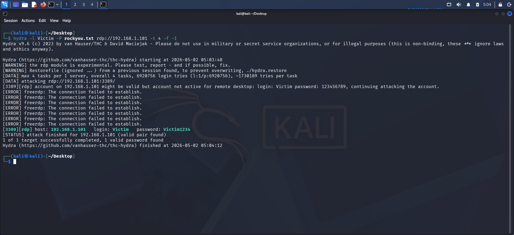

## 📈 3. Exploitation & Privilege Escalation (T1068)
### Weaponization
Generated a reverse shell payload and delivered it via a Python server.
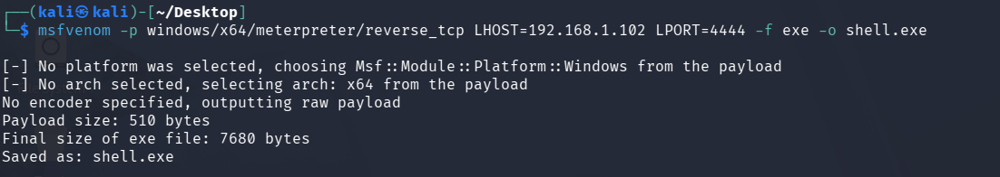 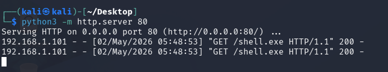

### Gaining a Foothold
Established a Meterpreter session: 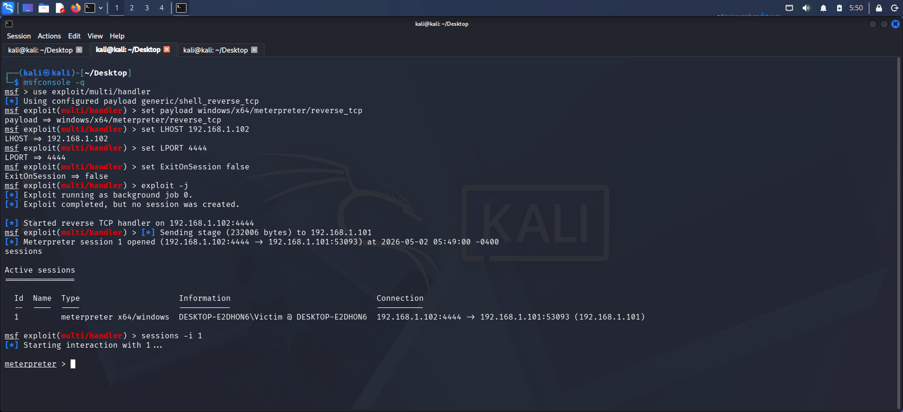

### Escalating to SYSTEM
Used UAC bypass techniques to gain full administrative control.
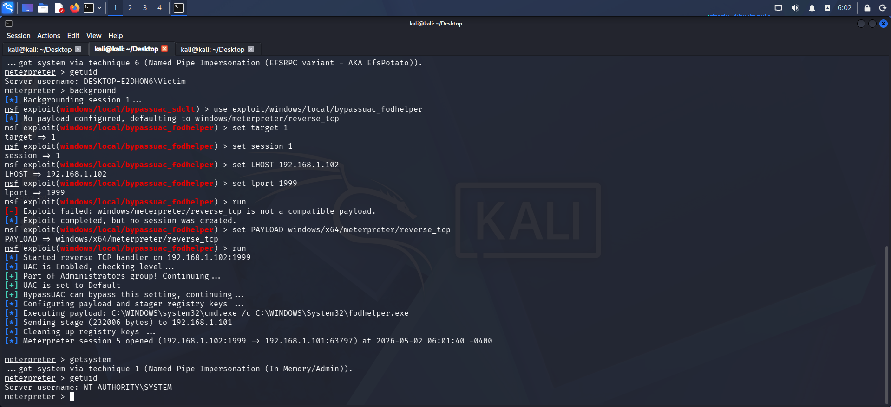 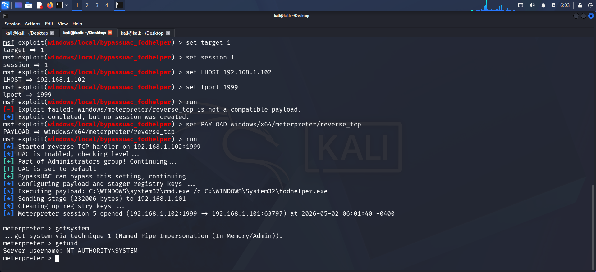

## 🕵️ 4. Persistence & Lateral Movement
### Process Migration & Registry Keys
Migrated the shell to `explorer.exe` for stability and added a 'Run' key for persistence.
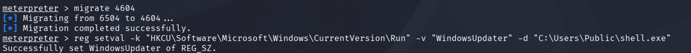

### Backdoor Accounts
Created a hidden admin account called `Support_Acc`.
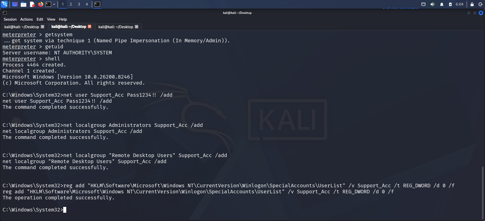
- **Verifying Access:** 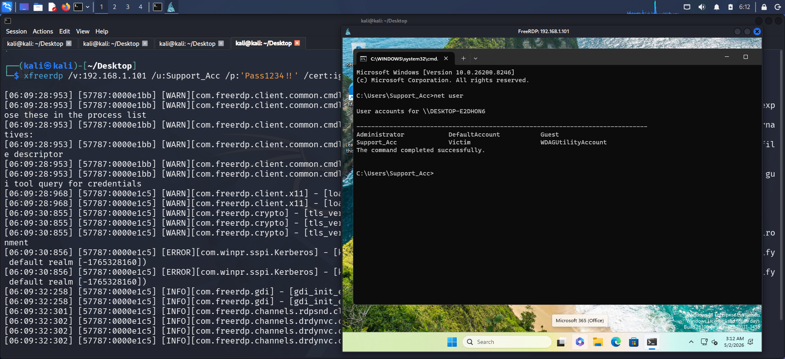 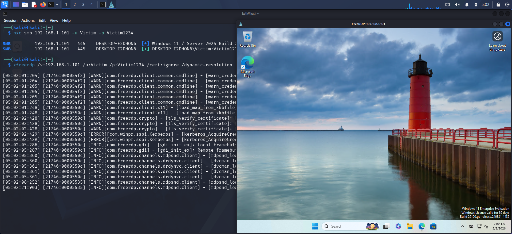

### Command Execution
Used **Impacket-WMIExec** and **NetExec (NXC)** for stealthy execution.
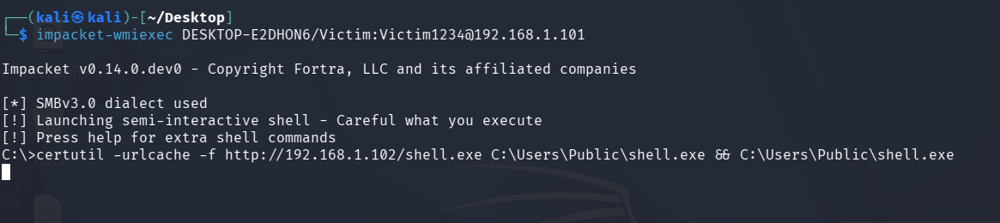 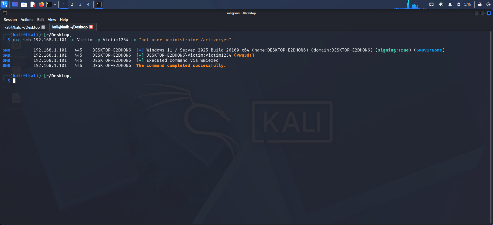

## 📂 5. Credential Access
Dumped local NTLM hashes from the SAM database.
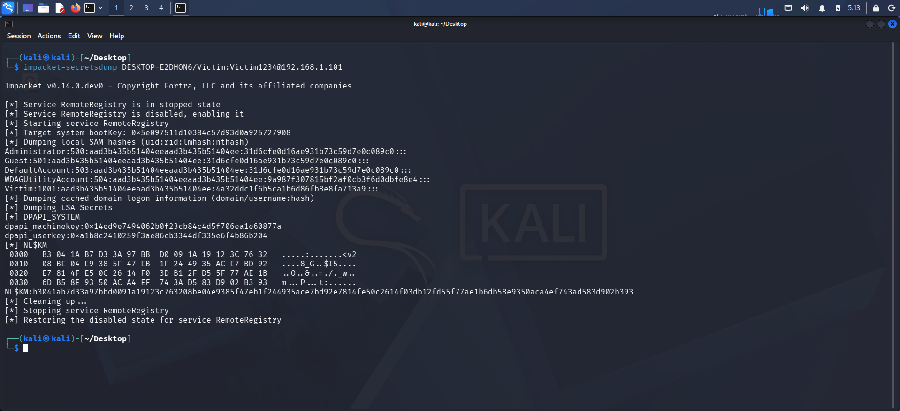
