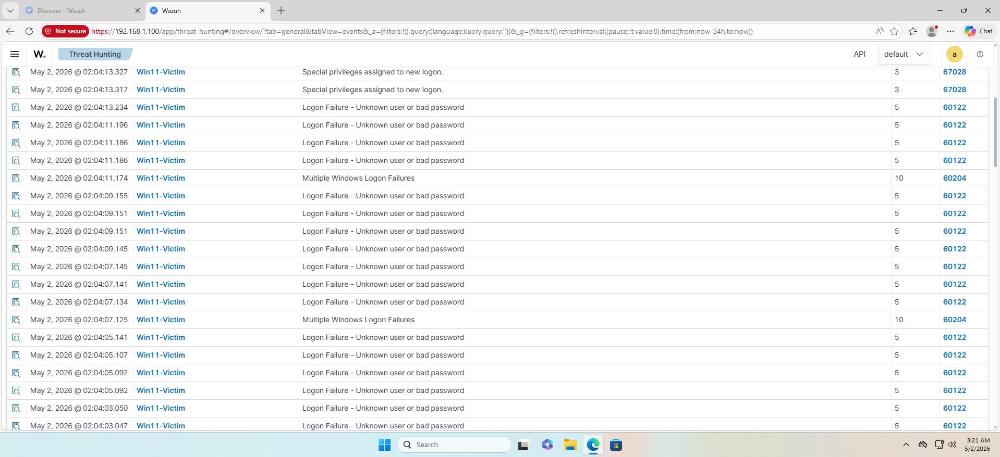
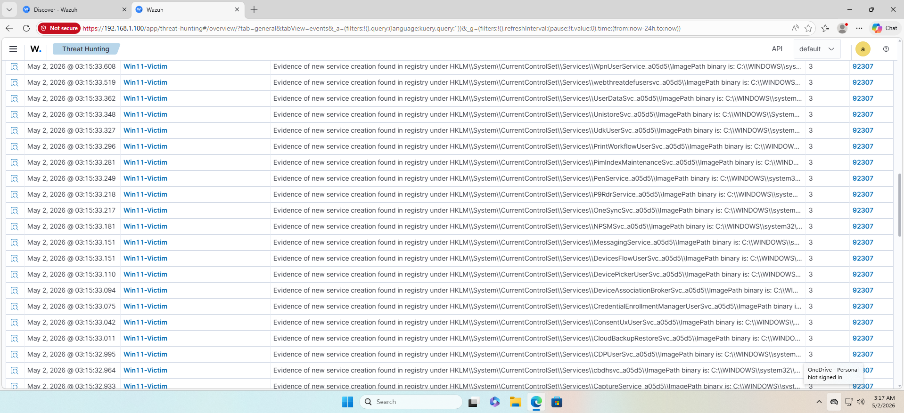
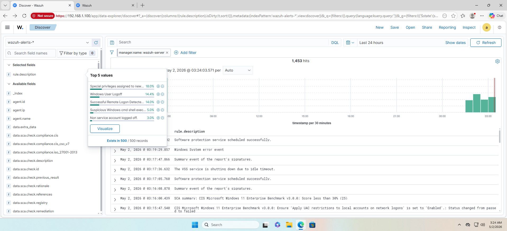
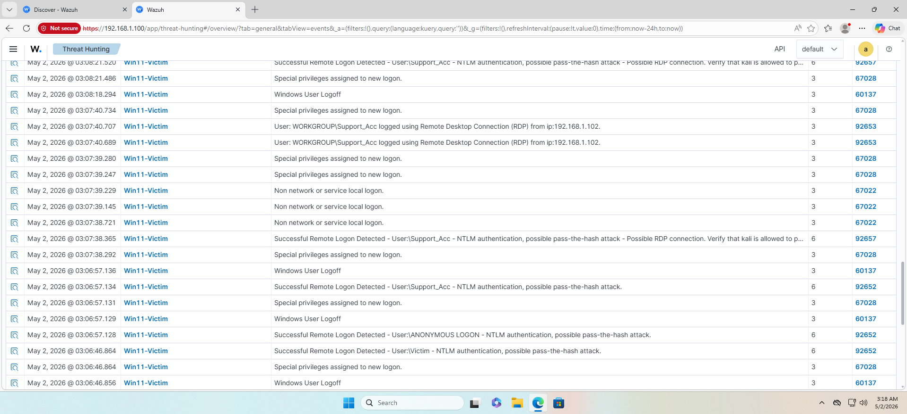
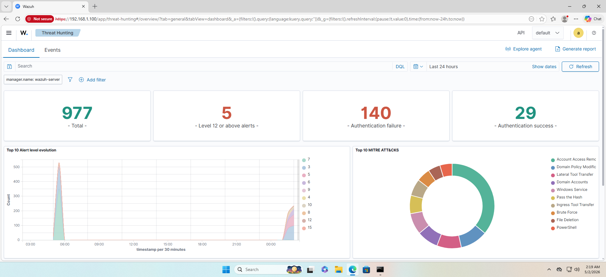

# 🔍 Threat Hunting & Incident Analysis Logbook

This document details the forensic analysis of the simulated attacks and how they were visualized within **Wazuh SIEM/XDR**.

## 1. Brute Force Analysis
The attacker used **Hydra** for an RDP brute-force attack.

- **Detection Logic:** Correlation of multiple Event ID 4625 (Failed Logon).
- **Evidence:**

*Visualizing the spike in failed login attempts.*

---

## 2. Post-Exploitation Forensics
Once the attacker gained access, several indicators of compromise (IoCs) were identified.

### Registry Persistence
The creation of a 'Run' key for the reverse shell was caught by Wazuh’s File Integrity Monitoring (FIM).

### Credential Dumping
The attacker attempted to dump NTLM hashes.

*Tracking NTLM authentication patterns in the logs.*

---

## 3. Advanced Hunting with Dashboards
The **Wazuh Threat Hunting Dashboard** allowed me to map the entire attack to the MITRE ATT&CK framework.

*Comprehensive view of the "Kill Chain" activity.*

### Key Findings:
- **Source IP:** 192.168.1.102 (Kali Linux)
- **Target User:** Victim
- **Persistence Method:** Registry Modification (T1547)
- **Privilege Level:** NT AUTHORITY\SYSTEM (After UAC Bypass)
